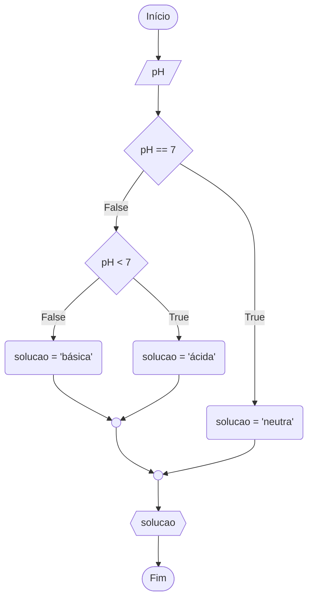

# ALGORITMO

O termo evoluiu bastante incluindo todos os procedimentos definidos para \
resolver problemas ou realizar tarefas.

Do ponto de vista computacional, um algoritmo pode ser visto como um conjunto \
de regras e procedimentos lógicos perfeitamente definidos que levam à solução \
de um problema em um número finito de passos.

Donald Knuth, um dos pesquisadores mais respeitados em algoritmos, indica uma \
lista de cinco propriedades que são requisitos para algoritmos:

* **Finitude**: um algoritmo deve sempre terminar após um número finito de \
etapas (ou passos).
* **Definição**: cada passo de um algoritmo deve ser definido com precisão. \
As ações a serem executadas deverão ser especificadas rigorosamente e sem \
ambiguidades.
* **Entrada**: valores que são dados ao algoritmo antes que ele inicie.
* **Saída**: os valores resultantes das ações do algoritmo a partir de uma \
determinada entrada.
* **Eficácia**: todas as operações a serem realizadas pelo algoritmo devem ser \
suficientemente básicas para poderem, em princípio, ser feitas com precisão e \
em um período de tempo finito por um homem usando papel e lápis.

Embora os requisitos de Knuth sejam intuitivos, falta-lhes rigor formal. \
A formalidade pode ser conseguida com o uso de lógica. Assim, vamos exigir que \
um algoritmo seja uma sequência lógica de passos com começo, meio e fim.

Comumente, esta lógica é conhecida como lógica de programação.

## LÓGICA DE PROGRAMAÇÃO

De um ponto de vista mais geral, podemos dizer que Lógica é uma parte da \
Filosofia que trata das formas do pensamento em geral (dedução, indução, \
hipótese, inferência, dentre outros) e das operações intelectuais que visam à \
determinação do que é verdadeiro ou falso. Dentre outras coisas, a Lógica pode \
produzir algoritmos para estas formas e operações.

A fim de resolver um problema computacionalmente, duas coisas são necessárias: \
uma representação que capta todos os aspectos relevantes do problema, e um \
algoritmo que resolve o problema pelo uso da representação.

## FLUXOGRAMA

É uma ferramenta utilizada para representar a sequência e interação da \
atividade do processo por meio de símbolos gráficos.

Os símbolos proporcionam uma melhor visualização do funcionamento do processo, \
ajudando no seu entendimento e tornando a descrição do processo visual e \
intuitiva.

No gerenciamento de processos a ferramenta garante a qualidade e aumenta a \
produtividade.

Documentar o fluxo de atividades torna possível realizar melhorias e esclarece \
o próprio fluxo de trabalho.

### VANTAGENS

* Melhora a compreensão do processo de trabalho.
* Mostra os passos necessários para realização do trabalho.
* Cria normas padrão para execução dos processos.
* Demonstra a sequência e interação entre as atividades.
* Pode ser utilizado para encontrar falhas no processo.
* Pode ser utilizada como fonte de informação para análise crítica.
* Facilita a consulta em caso de dúvidas sobre o processo.

---

Faça um algoritmo que leia o valor do índice de acidez (pH) de uma solução e \
informe (exiba na tela) se ela é ácida, básica ou neutra.
* A solução é ácida quando o pH é menor que 7.
* A solução é básica quando o pH é maior que 7.
* Caso contrário a solução é neutra.

